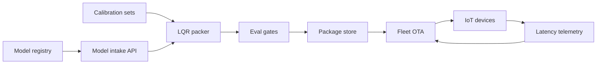

# BitNest

**Source:** `ai-in-iot/1805.09473/`
**Domain:** `ai-iot`
**One-liner:** A deployment toolchain that packs large CNNs into local quantization regions so resource-constrained IoT controllers run vision and speech models on-device at 8-bit down to 1-bit without shipping every inference to the cloud.
**Wedge:** Embedded product teams shipping Edison-class or similar MCU/SoC IoT nodes that must run Caffe-zoo-scale classifiers under hard latency and bill-of-materials caps.
**Positioning:** On-device DNN packaging for constrained IoT. Cloud offload burns bandwidth and privacy; FPGA/ASIC accelerators raise area cost. BitNest productizes local quantization region packing — per-region fixed-point scales plus optional MAC-to-LUT substitution — so OEMs keep accuracy while cutting compute and transistor budget.

## Market research synthesis

### Thesis from source

The source argues that scaling deep networks (more data, more parameters, GPU and CPU clusters with billions of connections) has made state-of-the-art models incompatible with low-cost IoT: limited compute and memory prevent real-time response. Common escapes fail commercially. Shipping activations to a server center creates traffic and privacy exposure. Compressing then decompressing networks shifts burden back onto the device. FPGA and ASIC accelerators improve performance-per-watt (cited as roughly six times mobile processors and twenty times high-end CPUs or GPUs) but raise chip area with network size.

The differentiating claim is not generic INT8 quantization. Global quantization that shares one scale across a layer collapses under extremely low precision (4-, 2-, and 1-bit). Local quantization regions keep separate numeric ranges for neuron groups so quantization error stays bounded. On Caffe model-zoo tasks evaluated on Intel Edison, the paper’s 8-bit scheme reports no drop on top-1 or top-5 with about 2× speedup; a 2-bit scheme drops only about 0.7% accuracy while largely saving transistors. Once low-bit is usable, multiply-accumulate can be replaced with table look-ups for further controller-side speedups — opening optimization on commodity IoT silicon without a custom accelerator.

### Buyer & economic model

- **Primary buyer:** VP of Embedded Software or Edge AI at IoT OEMs and industrial gateway vendors.
- **Users:** ML engineers packaging models, firmware teams integrating inference runtimes, hardware architects sizing BOM, QA for accuracy regression, privacy officers for on-device versus cloud policy.
- **Budget owner / value metric:** product COGS and cloud inference spend. Value metrics: on-device latency SLA, accuracy delta versus float baseline, energy per inference, avoided NRE for custom silicon.
- **Competing status quo:** float32 runtimes with cloud fallback; hand-tuned INT8 without region scales; vendor NPU SDKs that do not expose 2/1-bit or LUT paths.

### Domain constraints

- **Regulatory / trust / safety:** safety-critical vision needs documented accuracy floors before shipping low-bit builds; on-device inference reduces but does not eliminate privacy obligations for captured media.
- **Data sensitivity:** calibration sets used to fit region scales can leak customer imagery if retained; LUT tables are derived artifacts that must be treated as model IP.
- **Change-management realities:** firmware OTA of quantized packages must be versioned and rollable; operators will not accept silent accuracy cliffs after a bit-width change.

## Business requirements

- BR-1: Every packaged model must declare bit-width (8/4/2/1) and local-region policy, with a reported task-metric delta versus the float baseline on a frozen eval set.
- BR-2: 8-bit packages targeting Edison-class CPUs must meet a documented speedup target (≥1.5× versus float) without exceeding the customer’s accuracy drop budget (default 0%).
- BR-3: Extremely low-bit packages (≤4-bit) must not ship unless local quantization regions are enabled; global-scale-only packing is rejected by policy.
- BR-4: Optional LUT substitution for MAC must be selectable per layer and measured for latency and memory footprint before promotion.
- BR-5: Calibration data retention must be purpose-limited and deletable after region scales are sealed.
- BR-6: Each deployed package is immutable once promoted; rollback to a prior package ID is a first-class operator action.
- BR-7: Device fleets must report inference latency and watchdog timeouts so regressions after OTA are visible within one release cycle.
- BR-8: Packaging must work from standard Caffe or ONNX weights without requiring customers to retrain from scratch for the first beachhead.
- BR-9: Commercial packaging prices by devices under management and packaging jobs per month, not by cloud GPU hours.
- BR-10: Accuracy regression gates must block promotion when delta exceeds the signed SLA for that product SKU.
- BR-11: Audit export must show which region scales and bit-widths produced any production inference package.
- BR-12: Privacy mode must allow on-device-only inference with no activation upload as a contractual default for regulated customers.

## User stories

Canonical user stories live in sibling [USER_STORIES.md](USER_STORIES.md).

## System design

### Overview

BitNest ingests float models and calibration batches, partitions tensors into local quantization regions, fits per-region scales, emits fixed-point packages (8-bit to 1-bit) with optional LUT layers, runs eval gates, and distributes immutable packages to device fleets with telemetry and rollback.

### Actors & boundaries

- **Actors:** ML engineers, firmware teams, hardware architects, release managers, privacy officers, device agents.
- **Trust boundary:** calibration media stays in the customer’s packaging workspace; only sealed scales, LUTs, and packages leave. Devices never send activations upstream in on-device-only mode.
- **Human-in-the-loop points:** bit-width selection, accuracy-budget sign-off, promotion past regression gates, rollback authorization.

### Core capabilities

1. **Model intake** — Caffe/ONNX import and target-board profiles.
2. **Local quantization region packing** — region partitioning and scale fitting.
3. **Bit-width profiles** — 8/4/2/1-bit packaging with accuracy reports.
4. **LUT acceleration options** — MAC-to-table substitution where profitable.
5. **Eval gates and promotion** — frozen metrics and immutable package IDs.
6. **Fleet distribution and rollback** — OTA with latency telemetry.
7. **Privacy controls** — calibration retention and on-device-only attestation.
8. **Audit export** — manifest of scales, bit-widths, and eval results.

### Conceptual data

- **Primary entities:** ModelArtifact, TargetBoard, CalibrationSet, QuantRegion, Package, EvalReport, FleetDevice, Deployment, RollbackEvent, PrivacyPolicy.
- **Critical events:** packing started, regions fitted, eval completed, package promoted, OTA applied, latency SLA breached, rollback executed, calibration purged.
- **Retention / audit needs:** packages and eval reports retained for product lifetime; calibration media default short TTL; manifests immutable.

### Integrations (conceptual)

- **Systems of record:** ML model registries, firmware CI, device fleets/MDM.
- **Upstream signals:** float checkpoints, board power/latency profiles, customer eval sets.
- **Downstream actions:** OTA package install, cloud-offload disablement, alert on SLA breach.

### High-level architecture

### Success metrics

- **Leading:** packages promoted within accuracy budget; share of devices on on-device-only; packing job cycle time.
- **Lagging:** cloud inference cost avoided; field latency SLA compliance; field failures tied to mis-detection after quantization.

## OpenAPI skeleton

Canonical HTTP surface lives in sibling `openapi.yaml`. Summarize here:

- **Base path:** `/v1/...`
- **Auth:** API key and/or Bearer JWT (operator)
- **Resource groups:** Models, Packages, EvalReports, Fleets, Privacy
