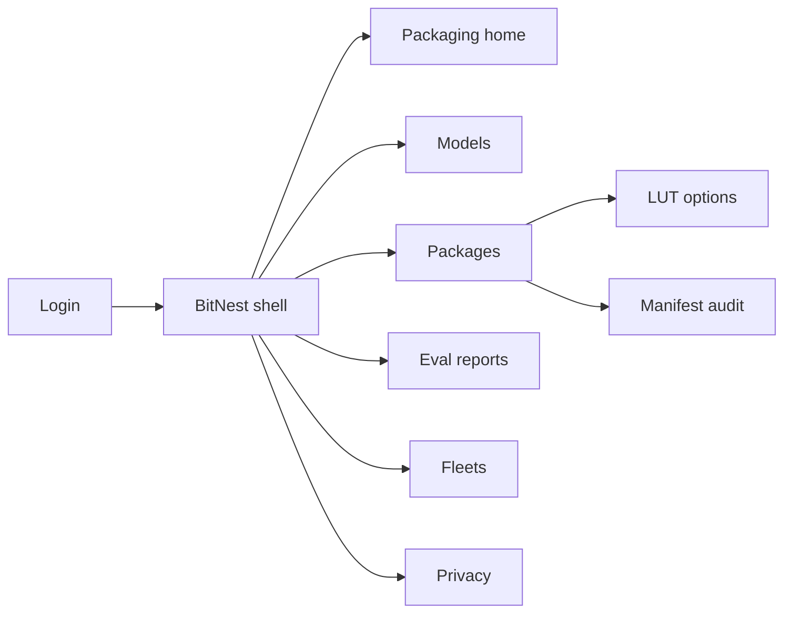
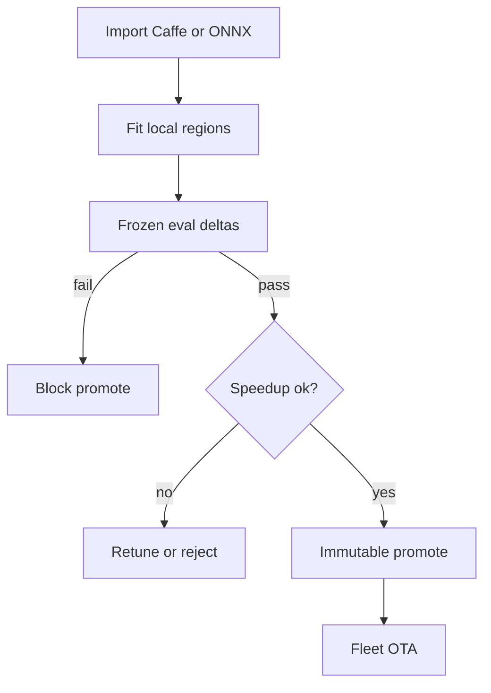
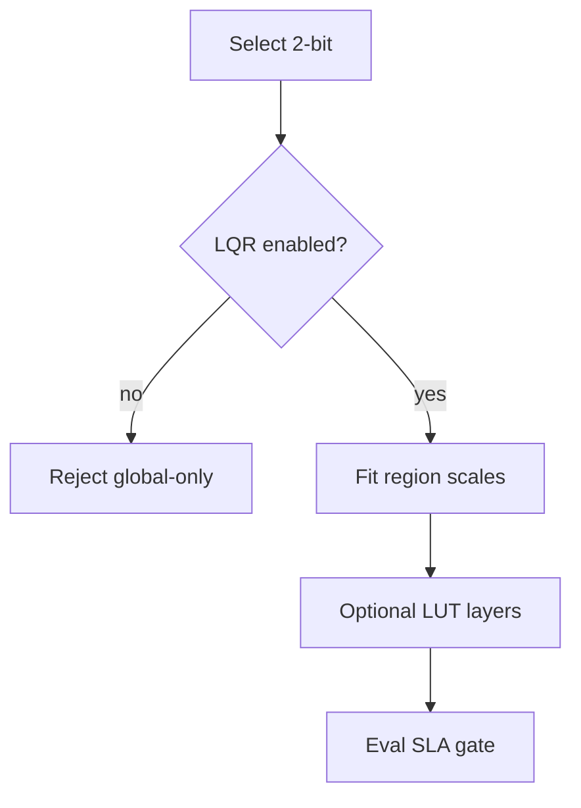

# BitNest — Web app

**Product:** [PRODUCT.md](./PRODUCT.md)
**Primary surface:** On-device DNN packaging console (embedded ML + release under one BitNest shell)
**Secondary surfaces:** Immutable package manifest / audit export (read-only); fleet latency SLA board
**Design thesis:** BitNest is a bit-width nest for constrained controllers — the UI metaphor is packing a zoo-scale CNN into local quantization regions (not a single global scale), then sealing an immutable field egg for OTA. Visual language is cool graphite with nest-amber region boundaries and signal-green 8-bit “no drop” confirmation: global-only ≤4-bit packs look illegal; a sealed package feels uneditable. The wordmark sits as a quiet amber seal on every eval-gate and manifest screen so OEMs know whose bit-width SLA they are shipping.

## UX research synthesis

### Category peers (best-in-class)

- **TensorFlow Lite / Model Optimization Toolkit UIs:** Quantization-aware flows with size/latency/accuracy tradeoffs. Steal: bit-width profile comparison with frozen eval; reject one-global-scale INT8 as sufficient for 2/1-bit (BR-3).
- **Qualcomm AI Hub / Arm CMSIS-NN style deploy tools:** Board-target packaging and on-device latency reports. Steal: target-board profiles and package artifacts for firmware (BR-8); reject NPU-only paths that hide LUT options on commodity CPUs.
- **Edge Impulse deployment view:** Job pipeline from model → optimized artifact → device. Steal: clear packing job stages and promotion gates; reject tiny-ML classifier framing — BitNest targets Caffe-zoo-scale CNNs on Edison-class nodes.
- **Balena / Mender OTA consoles:** Immutable releases with one-click rollback on fleet telemetry breach. Steal: package immutability + rollback as first-class (BR-6, BR-7); reject silent bit-width flips without eval.

### Patterns to adopt / reject

- **Adopt:** Local quantization regions mandatory for ≤4-bit; per-package bit-width + region policy + eval delta; LUT per-layer toggles with latency/memory; calibration purge after seal; on-device-only manifest attestation; promotion blocked on SLA miss; fleet latency/watchdog telemetry.
- **Reject:** Global-scale-only low-bit shipping; editable promoted packages; purple AI glow; cloud GPU-hour pricing chrome; silent accuracy cliffs; retaining calibration imagery after scales sealed.

### Trust, density, and workflow constraints from PRODUCT.md

Safety-critical vision needs documented accuracy floors (domain). Calibration sets can leak imagery — purpose-limited, deletable (BR-5). LUT tables are model IP. OTA must be versioned and rollable; operators reject silent cliffs (change-management). 8-bit aims ≥1.5× speedup with default 0% drop budget (BR-2). Privacy mode: no activation upload (BR-12).

## Information architecture

### Nav model

### Roles → default home

| Role | Default home | Why |
|------|--------------|-----|
| Embedded ML engineer | Packaging home / Packages | Region pack + deltas (BR-1) |
| Firmware engineer | Fleets | OTA + rollback (BR-6, BR-7) |
| Hardware architect | Packages — footprint estimates | Avoid FPGA when software enough |
| QA / release manager | Eval reports | Gate promotion (BR-10) |
| Privacy officer | Privacy | Calibration purge + on-device-only (BR-5, BR-12) |

### Cross-links to OpenAPI resources

| Nav area | OpenAPI tags / resources |
|----------|---------------------------|
| Float intake / boards | Models |
| LQR bit-width artifacts | Packages |
| Frozen metrics & gates | EvalReports |
| OTA devices & telemetry | Fleets |
| Calibration & on-device policy | Privacy |

## Screen inventory

### Packaging home

- **Purpose:** Answer “which packs are shippable under accuracy budgets, and which fleets regress after OTA?” in one composition.
- **Entry:** ML engineer default; deep link from SLA breach.
- **Layout regions:** Brand chrome; KPI strip (promotions in budget, 8-bit speedup median, low-bit blocked-without-LQR count, on-device-only share, open rollbacks); packing job queue; fleet breach rail.
- **Primary actions:** New pack job; open blocked eval; open fleet rollback.
- **Empty / loading / error:** Empty = import first Caffe/ONNX model; error = retry with request id.
- **BR / story ties:** BR-1, BR-2, BR-9.

### Model intake

- **Purpose:** Import Caffe/ONNX weights and bind target-board profiles without mandatory retrain for beachhead.
- **Entry:** Models nav; home CTA.
- **Layout regions:** Model list (zoo source, boards, last pack); intake wizard; board profile picker (Edison-class etc.).
- **Primary actions:** Import; attach eval set; start pack.
- **Empty / loading / error:** Unsupported op = inline reject with layer id.
- **BR / story ties:** BR-8; ML engineer stories.

### Pack job — local regions

- **Purpose:** Partition into local quantization regions, fit per-region scales; reject global-only when ≤4-bit selected.
- **Entry:** From model → Pack.
- **Layout regions:** Bit-width selector (8/4/2/1); region policy visualization; global-vs-local comparison when relevant; calibration progress; policy banner blocking global-only ≤4-bit (BR-3).
- **Primary actions:** Fit regions; compare global abort path; continue to LUT/eval.
- **Empty / loading / error:** Global-only + ≤4-bit = hard block, not warning.
- **BR / story ties:** BR-1, BR-3; ML engineer 2-bit vs global story.

### LUT options

- **Purpose:** Optional MAC→LUT substitution per layer with latency and memory footprint before promotion.
- **Entry:** Pack job → LUT; Packages detail.
- **Layout regions:** Layer table (MAC vs LUT, latency delta, memory delta); select profitable layers; SoC notes.
- **Primary actions:** Toggle layers; remeasure; save draft package.
- **Empty / loading / error:** Memory over board budget = coral block.
- **BR / story ties:** BR-4; hardware architect transistor/memory story.

### Eval reports and gates

- **Purpose:** Frozen eval set; top-1/top-5 (or task) delta vs float; block promotion when over SKU SLA.
- **Entry:** Eval nav; release manager default.
- **Layout regions:** Report bound to package id; delta vs budget; speedup for 8-bit; sign-off; promote control locked until pass.
- **Primary actions:** Sign budget; promote; reject; export audit.
- **Empty / loading / error:** Moving eval set after bind = forbidden; cliff = blocked promote (BR-10).
- **BR / story ties:** BR-2, BR-10; QA stories.

### Packages

- **Purpose:** Immutable promoted artifacts with runtime bindings; inspect region scales and bit-widths.
- **Entry:** Packages nav.
- **Layout regions:** Package table (bit-width, LQR on, LUT layers, eval delta, privacy mode); detail with sealed scales summary; download for firmware.
- **Primary actions:** Download; open manifest; initiate OTA; cannot edit sealed fields.
- **Empty / loading / error:** Edit attempt on promoted = explained immutability (BR-6).
- **BR / story ties:** BR-6, BR-11.

### Fleets and OTA

- **Purpose:** Distribute packages; watch inference latency and watchdog timeouts; rollback on SLA breach.
- **Entry:** Fleets nav; firmware default.
- **Layout regions:** Fleet table (package id, latency p50/p95, timeouts); OTA progress; rollback CTA; breach alerts within release cycle.
- **Primary actions:** Deploy; pause; rollback to prior package id.
- **Empty / loading / error:** Telemetry gap = amber “blind OTA” warning.
- **BR / story ties:** BR-7; firmware engineer rollback story.

### Privacy

- **Purpose:** Calibration retention TTL and purge after scales sealed; on-device-only attestation in manifest.
- **Entry:** Privacy nav; privacy officer default.
- **Layout regions:** Calibration sets with TTL; purge control post-seal; on-device-only policy default for regulated SKUs; audit of activation-upload flags (must be off).
- **Primary actions:** Purge calibration; lock on-device-only; export attestation.
- **Empty / loading / error:** Activation upload enabled on regulated SKU = coral block.
- **BR / story ties:** BR-5, BR-12.

### Manifest audit export

- **Purpose:** Show which region scales and bit-widths produced any production package.
- **Entry:** Package → Manifest; compliance secondary.
- **Layout regions:** Read-only manifest (bit-width, region policy hash, LUT map, eval ids, privacy flags); download.
- **Primary actions:** Export; attach to release ticket.
- **Empty / loading / error:** Draft packages marked non-production.
- **BR / story ties:** BR-11.

## Key flows

1. **Ship an 8-bit LQR package** — import model → local regions → eval (0% drop default) → speedup check → promote → OTA; failure: delta over budget or speedup under 1.5×.

2. **Attempt 2-bit pack** — select ≤4-bit → require LQR (reject global-only) → optional LUT → eval gate → promote or stop (BR-3, BR-4, BR-10).

3. **Calibration purge** — seal scales → purge imagery → attest (BR-5).

4. **Latency SLA breach** — telemetry → rollback to prior package id (BR-6, BR-7).

5. **On-device-only contract** — privacy lock in manifest → devices never upload activations (BR-12).

## Design system

### Tokens (CSS variables)

- `--color-ink: #E8EEF2` — primary text
- `--color-graphite-950: #0B0F14` — app ground
- `--color-graphite-900: #141A22` — panels
- `--color-graphite-700: #2C3644` — rules
- `--color-nest: #E0A84A` — region boundaries / brand accent
- `--color-nest-dim: #8A6428` — nest on dark
- `--color-signal: #3DDC97` — eval pass / 8-bit no-drop
- `--color-coral: #E85D4C` — gate fail / illegal global low-bit
- `--color-amber: #E6A23C` — draft / telemetry gap
- `--color-steel: #7A9BB0` — secondary labels
- `--color-brand: #E8C48A` — BitNest wordmark
- `--font-display: "Space Grotesk", sans-serif`
- `--font-mono: "IBM Plex Mono", monospace` — package ids, bit-widths, hashes
- `--space-1`…`--space-8`: 4px scale
- `--radius-sm: 4px`; `--radius-md: 8px`
- `--motion-seal: 180ms ease-out` — package promote lock
- `--motion-block: 200ms ease-in-out` — illegal global-lowbit flash
- `--motion-ota: 280ms linear` — deploy progress
- Atmosphere: subtle nested-rectangle region grid in graphite-900; no stock “AI chip” purple renders.

### Typography & brand

- Display for bit-width and delta numerals; mono for package ids and scale hashes.
- Brand on eval and manifest views; login: “Nest the bits, seal the pack.”

### Do / don’t

- **Do:** Mandate LQR for ≤4-bit; freeze eval sets; immutable promotes; purge calibration; show LUT cost/benefit.
- **Don’t:** Purple AI glow; edit sealed packages; ship global-only 2-bit; retain customer imagery post-seal; hide activation-upload flags.

### Accessibility & domain trust cues

- AA+ on nest/signal/coral; blocked promote also text “Over accuracy SLA.”
- Live regions for OTA breach and rollback.
- Focus: models → pack/LQR → eval → packages → fleets → privacy.

## Component patterns

- **BitWidthSelector** — 8/4/2/1 with policy hints.
- **LqrRegionMap** — local region boundaries vs illegal global-only.
- **EvalDeltaGate** — top-1/top-5 vs SKU budget lock.
- **LutLayerTable** — per-layer MAC→LUT latency/memory.
- **ImmutablePackageCard** — sealed id, no edit.
- **FleetLatencyBoard** — p50/p95 and watchdog timeouts.
- **RollbackAction** — prior package id restore.
- **CalibrationPurgeControl** — post-seal delete.
- **OnDeviceOnlyAttestation** — manifest privacy lock.
- **ManifestExport** — scales + bit-widths audit.

## Out of scope for v1 web

- Full training AutoML; custom ASIC place-and-route; cloud vision API product; mobile app store console; replacing OEM MDM wholesale; interactive neural architecture search studio.
